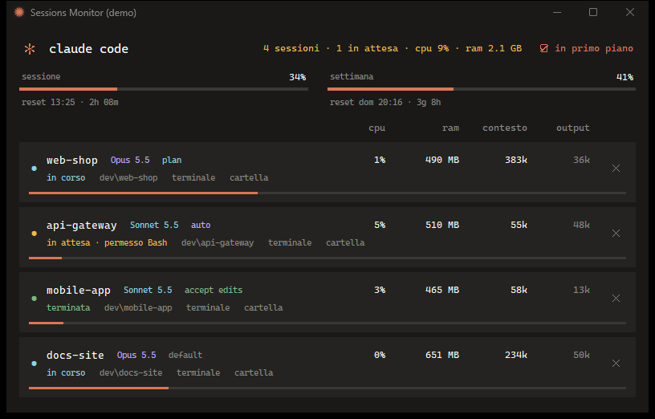
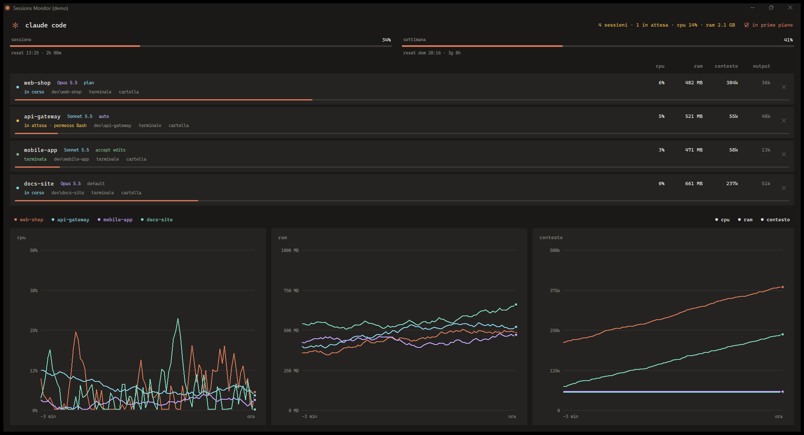

# Sessions Monitor per Claude Code

[English](README.md)

Un piccolo widget per Windows che elenca tutte le sessioni di [Claude Code](https://claude.com/claude-code) in esecuzione, mostra quanto consuma ciascuna, segnala quali aspettano te e permette di chiuderne una, solo dopo la tua conferma.



> Progetto non ufficiale, non affiliato ad Anthropic. Legge file che Claude Code non documenta e che possono cambiare con qualsiasi aggiornamento (vedi [Limiti](#limiti)).

## Funzioni

- **Tutte le sessioni in un colpo d'occhio**: nome, cartella, modello, modalità dei permessi (plan, auto, accept edits...).
- **Consumo**: CPU e RAM della sessione compresi i processi figli (server MCP), dimensione del contesto e token di output, letti dal transcript della sessione.
- **Stato a colori**: azzurro = in corso, ambra lampeggiante = in attesa di te (una domanda, un piano da approvare, una richiesta di permesso), verde = terminata.
- **Usage del piano**: uso di sessione e settimanale con l'orario di reset (facoltativo, vedi [Usage del piano](#usage-del-piano)).
- **Scorciatoie terminale e cartella**: porta in primo piano il terminale della sessione, selezionando la scheda giusta di Windows Terminal, oppure apre la sua cartella.
- **Chiusura con conferma**: l'unica azione che tocca una sessione, e chiede sempre prima.
- **Responsive**: le colonne si adattano da un widget stretto (circa 340 px) fino allo schermo intero, dove compaiono i grafici in tempo reale di CPU, RAM e contesto. I grafici hanno dei filtri: clicca una sessione o un grafico per accenderlo o spegnerlo.
- **Italiano e inglese**, scelti in base alla lingua di Windows.
- **Nessuna dipendenza**: solo la libreria standard di Python.



## Requisiti

- Windows 10 o 11
- Python 3.9+ con tkinter (incluso nell'installer di python.org)
- Claude Code CLI

## Installazione e avvio

```powershell
git clone https://github.com/Andrew3run/claude-code-sessions-monitor.git
cd claude-code-sessions-monitor
.\install.ps1                  # facoltativo: crea un collegamento sul Desktop (-Remove per eliminarlo)
pythonw claude_monitor.pyw     # oppure doppio clic su claude_monitor.pyw
```

Opzioni: `--lang it|en` per forzare la lingua, `--demo` per provare l'interfaccia con sessioni finte (non viene letto nulla di reale e non si può chiudere nulla), `--version`.

Posizione, dimensione e filtri della finestra sono salvati in `%APPDATA%\claude-sessions-monitor\config.json`.

## Usage del piano

Claude Code passa i limiti del piano al comando della status line. Per mostrarli nel monitor servono poche righe che li salvino in `~/.claude/usage-snapshot.json`. Vedi [`statusline-usage.js`](statusline-usage.js): usalo come status line, oppure copia il blocco indicato nello script che hai già. Viene scritto solo `rate_limits`, in locale. Senza, il monitor funziona uguale e le due barre restano vuote.

## Come funziona

| Informazione | Fonte |
|---|---|
| Sessioni vive, nome, stato | `~/.claude/sessions/<pid>.json` (verificato con l'ora di avvio del processo, così un pid riutilizzato non viene scambiato per una sessione) |
| Token, modello, modalità dei permessi, chiamate in sospeso | `~/.claude/projects/*/<sessione>.jsonl`, letto in modo incrementale |
| CPU, RAM, processi figli | API Win32 tramite `ctypes` |
| Usage del piano | `~/.claude/usage-snapshot.json` |

«In attesa» è dedotto dal transcript: un `AskUserQuestion` o un `ExitPlanMode` in sospeso sono certi; per gli altri strumenti una chiamata senza risultato da più di 8 secondi con il processo fermo viene segnalata come richiesta di permesso.

## Sicurezza

- Il monitor è di sola lettura e non avvia mai sessioni. Non è genitore di nessuna sessione, quindi chiudere il widget non chiude mai una sessione.
- Una sessione si chiude solo dal pulsante ✕, dopo una finestra di conferma. Prima di terminare verifica che il pid sia ancora lo stesso processo.
- In Windows Terminal viene chiusa anche la scheda della sessione, ma solo se esattamente una scheda corrisponde al titolo della sessione, così la scheda di un'altra sessione non può mai essere colpita. Altrimenti (scheda rinominata, altri terminali) la sessione viene fermata con `taskkill /PID <pid> /T /F` e il terminale resta aperto, con quello che era rimasto a schermo.
- Il lavoro in corso in quella sessione va perso.
- Nessun accesso alla rete, nessuna telemetria.

## Limiti

- Solo Windows.
- Si basa su file e formati non documentati di Claude Code: un aggiornamento può rompere alcune parti.
- La richiesta di permesso è dedotta, quindi può sbagliare (per esempio un comando lungo che aspetta la rete può sembrare una richiesta).
- La selezione della scheda del terminale funziona con Windows Terminal e confronta il titolo della scheda con quello della sessione; se hai rinominato la scheda viene portata in primo piano solo la finestra.
- La barra del contesto assume una finestra da 1M di token (`CONTEXT_WINDOW` nel codice).

## Licenza

[MIT](LICENSE)
