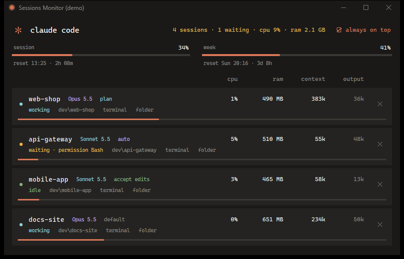
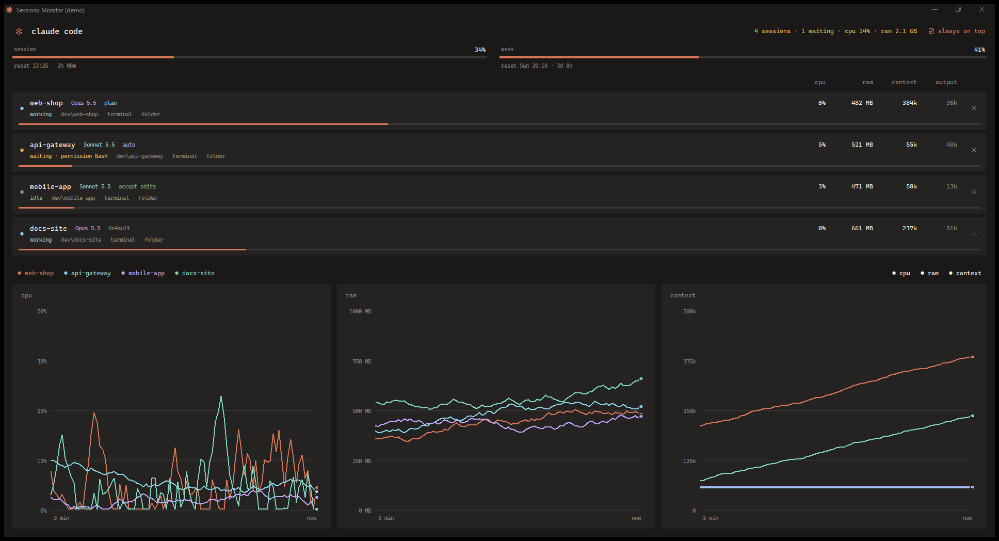

# Sessions Monitor for Claude Code

[Italiano](README.it.md)

A small Windows widget that lists every running [Claude Code](https://claude.com/claude-code) session, shows what each one consumes, tells you which ones are waiting for you, and lets you close one, only after you confirm.



> Unofficial project, not affiliated with Anthropic. It reads files that Claude Code does not document and that can change with any update (see [Limitations](#limitations)).

## Features

- **All sessions at a glance**: name, folder, model, permission mode (plan, auto, accept edits...).
- **Consumption**: CPU and RAM of the session including its child processes (MCP servers), context size and output tokens, from the session transcript.
- **State by color**: blue = working, amber and blinking = waiting for you (a question, a plan to approve, a permission prompt), green = idle.
- **Plan usage**: session and weekly usage with the reset time (optional, see [Usage limits](#usage-limits)).
- **Terminal and folder shortcuts**: brings the session's terminal to the front, selecting the right Windows Terminal tab, or opens its folder.
- **Close with confirmation**: the only action that touches a session, and it always asks first.
- **Responsive**: the columns adapt from a narrow widget (about 340 px) to full screen, where live charts of CPU, RAM and context appear. Charts have filters: click a session or a chart to switch it on or off.
- **Italian and English**, chosen from the Windows display language.
- **No dependencies**: Python standard library only.



## Requirements

- Windows 10 or 11
- Python 3.9+ with tkinter (included in the python.org installer)
- Claude Code CLI

## Install and run

```powershell
git clone https://github.com/Andrew3run/claude-code-sessions-monitor.git
cd claude-code-sessions-monitor
.\install.ps1                  # optional: creates a Desktop shortcut (use -Remove to delete it)
pythonw claude_monitor.pyw     # or just double-click claude_monitor.pyw
```

Options: `--lang it|en` to force a language, `--demo` to try the interface with fake sessions (nothing real is read, and nothing can be closed), `--version`.

Window position, size and filters are saved in `%APPDATA%\claude-sessions-monitor\config.json`.

## Usage limits

Claude Code passes the plan limits to your status line command. To show them in the monitor, a few lines must save them to `~/.claude/usage-snapshot.json`. See [`statusline-usage.js`](statusline-usage.js): use it as your status line, or copy the marked block into the script you already have. Only `rate_limits` is written, locally. Without it the monitor works the same and the two bars stay empty.

## How it works

| Information | Source |
|---|---|
| Live sessions, name, status | `~/.claude/sessions/<pid>.json` (validated against the process start time, so a reused pid is never mistaken for a session) |
| Tokens, model, permission mode, pending tool calls | `~/.claude/projects/*/<session>.jsonl`, read incrementally |
| CPU, RAM, child processes | Win32 API through `ctypes` |
| Plan usage | `~/.claude/usage-snapshot.json` |

"Waiting" is derived from the transcript: a pending `AskUserQuestion` or `ExitPlanMode` is certain; for other tools a call without a result for more than 8 seconds while the process is idle is reported as a permission prompt.

## Safety

- The monitor is read-only and never starts sessions. It is not the parent of any session, so closing the widget never closes a session.
- A session is closed only from the ✕ button, after a confirmation dialog. Before terminating, it checks that the pid still is the same process, then runs `taskkill /PID <pid> /T /F` (the session and its children). The work in progress in that session is lost.
- No network access, no telemetry.

## Limitations

- Windows only.
- Built on undocumented files and formats of Claude Code: an update can break parts of it.
- The permission prompt is inferred, so it can be wrong (for example a long command waiting on the network may look like a prompt).
- Selecting the right terminal tab works with Windows Terminal and matches the tab title with the session title; if you renamed the tab, only the window is raised.
- The context bar assumes a 1M-token window (`CONTEXT_WINDOW` in the code).

## License

[MIT](LICENSE)
